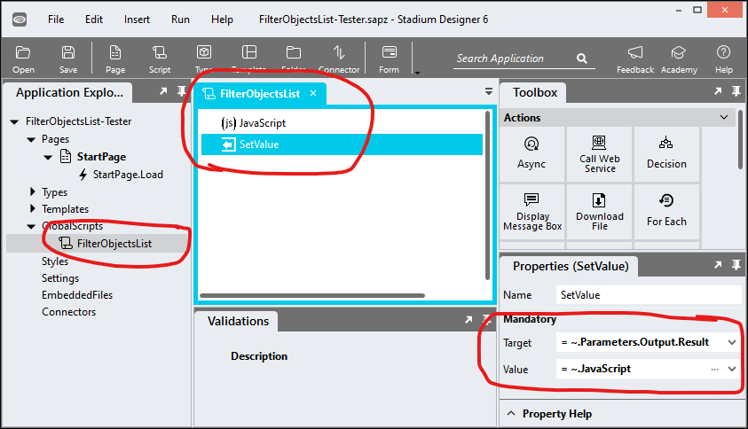
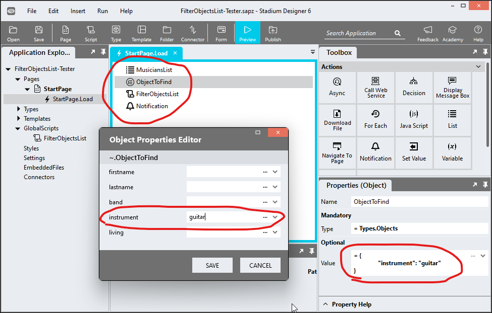

# Filter Objects List

A script to filter a list of objects by any number of object properties. Lists can be filtered by immediate properties, not properties of type Object or List. 

# Version 
1.1 Enhanced the script to cater for null parameters and booleans

# Global Script Setup
1. Create a Global Script called "FilterObjectsList"
2. Add the input parameters below to the Global Script
   1. List
   2. Properties
3. Add the output parameter below to the Global Script
   1. Result
4. Drag a *JavaScript* action into the script
5. Add the Javascript below unchanged into the JavaScript code property
```javascript
/* Stadium Script v1.1 https://github.com/stadium-software/utils-filter-objects-list */
let haystack = ~.Parameters.Input.List || [];
let needles = ~.Parameters.Input.Properties || {};
return haystack.filter(item =>
  Object.entries(needles)
    .every(([key, value]) =>
      value === undefined || item[key] === value
    )
);
```
6. Drag a *SetValue* action into the Global Script and place it under the *JavaScript* action
   1. Target: = ~.Parameters.Output.Result
   2. Value: = ~.Javascript



## Usage
1. Best practice is to create a Type that reflects the objects and contains its' properties
2. Create a List of that type
3. Drag the Type into the script and use the "Object Properties" editor to define the values to filter the List by. The example below shows a list of musicians. The filter contains an instruction to return a list of musicians where the value for "instrument" is "guitar". All other properties are ignored. 

4. Drag the script called "FilterObjectsList" into a script or event handler
5. Enter values for the script input parameters
   1. List: A List of objects, for example:
```json
[{
	"firstname": "George",
	"lastname": "Harrison",
	"band": "Beatles",
	"instrument": "guitar",
	"living": "false"
},{
	"firstname": "John",
	"lastname": "Lennon",
	"band": "Beatles",
	"instrument": "guitar",
	"living": "false"
},{
	"firstname": "Paul",
	"lastname": "McCartney",
	"band": "Beatles",
	"instrument": "bass",
	"living": "true"
},{
	"firstname": "Ringo",
	"lastname": "Star",
	"band": "Beatles",
	"instrument": "drums",
	"living": "true"
},{
	"firstname": "David",
	"lastname": "Gilmour",
	"band": "Pink Floyd",
	"instrument": "guitar",
	"living": "true"
},{
	"firstname": "Roger",
	"lastname": "Waters",
	"band": "Pink Floyd",
	"instrument": "bass",
	"living": "true"
},{
	"firstname": "Syd",
	"lastname": "Barrett",
	"band": "Pink Floyd",
	"instrument": "guitar",
	"living": "false"
},{
	"firstname": "Bob",
	"lastname": "Marley",
	"band": "The Wailers",
	"instrument": "voice",
	"living": "false"
},{
	"firstname": "Pete",
	"lastname": "Townshend",
	"band": "The Who",
	"instrument": "guitar",
	"living": "true"
},{
	"firstname": "Freddie",
	"lastname": "Mercury",
	"band": "Queen",
	"instrument": "voice",
	"living": "false"
},{
	"firstname": "Brian",
	"lastname": "May",
	"band": "Queen",
	"instrument": "guitar",
	"living": "false"
},{
	"firstname": "Jim",
	"lastname": "Morrison",
	"band": "The Doors",
	"instrument": "voice",
	"living": "false"
},{
	"firstname": "Jimi",
	"lastname": "Hendrix",
	"band": "The Jimi Hendrix Experience",
	"instrument": "guitar",
	"living": "false"
},{
	"firstname": "Michael",
	"lastname": "Jackson",
	"band": "Jackson 5",
	"instrument": "voice",
	"living": "false"
},{
	"firstname": "Rogers",
	"lastname": "Nelson",
	"band": "the Revolution",
	"instrument": "guitar",
	"living": "false"
},{
	"firstname": "Whitney",
	"lastname": "Houston",
	"instrument": "voice",
	"living": "false"
}]
```
   2. Property: An object that contains the filter criteria, for example:
```json
{ "instrument": "guitar" }
```
1. Result: The script returns a List of object that match the criteria 